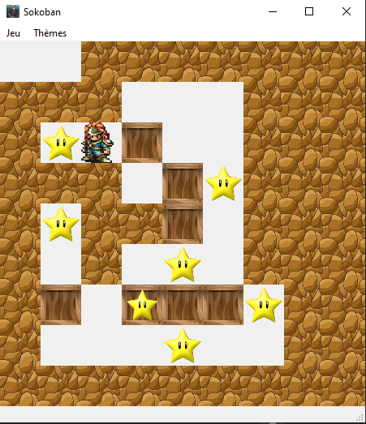

# Projet Sokoban IHM 

## Les membres de l'equipe

Ce groupe de projet est constituer de 4 personnes:

- Jonathan Caudron
- Maxence Dubois
- Corentin Gaspard
- Thibaut Gronier

## Comment lancer le jeux
Pour lancer le jeu,Il suffit d'avoir la librairie PyQt5 d'installer sur votre python puis lancer depuis votre IDE le fichier s'appellant main.py

## Les commande pour jouer 
Les commande pour déplacer le personnage il faut utiliser les fleches directionnelle :
- Fleche du haut pour allez vers le haut
- Fleche du bas pour allez vers le bas
- Fleche de gauche pour allez vers la gauche
- Fleche de droite pour allez vers la droite
