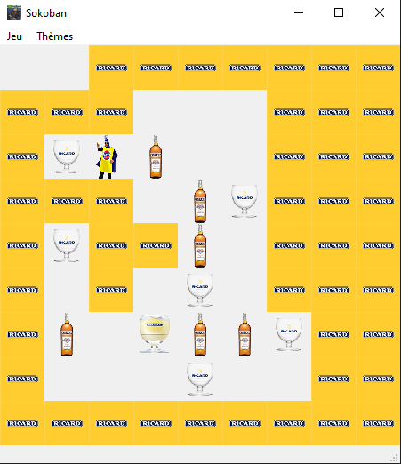
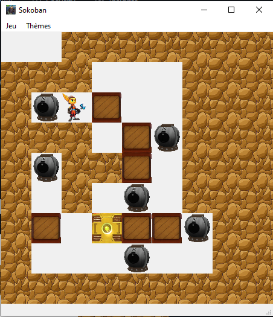
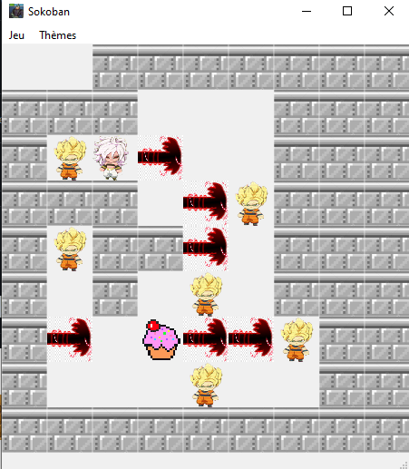

# Projet Sokoban IHM 

## Les membres de l'equipe

Ce groupe de projet est constituer de 4 personnes:

- Jonathan Caudron
- Maxence Dubois
- Corentin Gaspard
- Thibaut Gronier

## Comment lancer le jeux
Pour lancer le jeu,Il suffit d'avoir la librairie PyQt5 d'installer sur votre python puis lancer depuis votre IDE le fichier s'appellant main.py

## Les commande 
### Les commande de deplacement
Les commande pour déplacer le personnage il faut utiliser les fleches directionnelle :
- Fleche du haut pour allez vers le haut
- Fleche du bas pour allez vers le bas
- Fleche de gauche pour allez vers la gauche
- Fleche de droite pour allez vers la droite

### Raccourci Clavier
Les different racourci clavier que nous avons intergrer sont :
- Ctrl + Q : vous permettra de fermer la fenêtre du jeu plus facilement
- Crtl + R : vous permettra de relancer une partie du jeu plus facilement

## Les Differents Thèmes
### Le thème de base

Ce thème a été développer par tous les membres de l'équipe

### Le thème Ricard

Ce thème a été developper par Thibaut Gronier

### Le thème Ratchet et Clank

Ce thème a été developper par Corentin Gaspard

### Le thème Dragon Ball Z

Ce thème a été developper par Maxence Dubois

